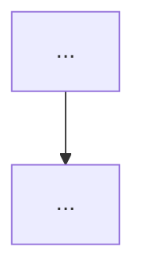

# [Product Name] — PRD

**Version**: [x.x]
**Date**: [YYYY-MM-DD]
**Authors**: [names]

## 1. Problem Statement
[User pain points and context]

## 2. Product Vision
[Goal and value proposition]

## 3. Objectives
[Measurable business and product goals]

## 4. Scope

**Included:**
- [...]

**Excluded:**
- [...]

## 5. User Personas

### [Persona Name]
- **Goal**: [...]
- **Pain point**: [...]

## 6. User Journeys

## 7. Functional Requirements

1. [Atomic, numbered requirement]
2. [...]

## 8. Non-functional Requirements

- **Performance**: [targets]
- **Security**: [requirements]
- **Accessibility**: [WCAG level and specifics]
- **Scalability**: [requirements]

## 9. Constraints

- [Technical, business, or regulatory limitations]

## 10. Success Metrics

- [KPI]: [target value]

## 11. Assumptions

- [What is assumed true for this PRD]

## 12. Risks

| Risk | Likelihood | Impact | Mitigation |
|------|-----------|--------|-----------|
| [risk] | High/Med/Low | High/Med/Low | [mitigation] |

## 13. Acceptance Criteria

- [ ] [Condition for feature completion]
